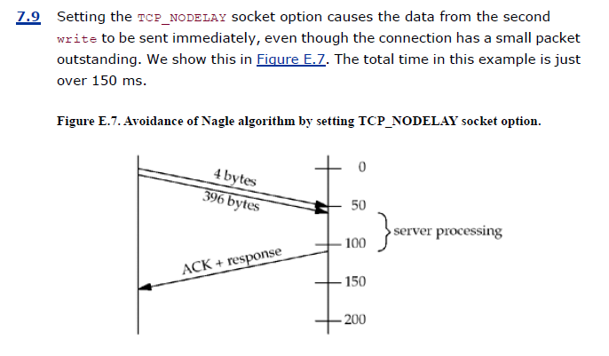

# Theory-questions

<details><summary>
TCP state transition diagram - IMPORTANT
</summary>


</details>

<details><summary>What are the different entities that comprise a socket pair?</summary>

A socket pair uniquely identifies every TCP connection on internet.
Socket pair comprise of 4 entities -

- local IP address
- local TCP port
- Foreign IP address
- Foreign TCP Port
</details>

<details><summary>What happens when a router receives an IPv4 datagram whose size exceeds the outgoing link's MTU?</summary>

## IPv4

- If size is greater than MTU, fragmentation is performed by the router on the packets it forwards.
- Fragments are reassembled once they reach the destination.
- IPv4 hosts performs fragmentation on datagrams they generate.
- IPv4 routers performs fragmentation on datagrams that they forward.
- If the "don't fragment" (DF) bit is set in the IPv4 header, it specifies that this datagram must not be fragmented, either by the sending host or by any router.
- A router that receives an IPv4 datagram with the DF bit set whose size exceeds the outgoing link's MTU generates an ICMPv4 error message "destination unreachable, fragmentation needed but DF bit set".
- If some intermediate router returns an ICMP "destination unreachable, fragmentation needed but DF bit set" error, TCP decreases the amount of data it sends per datagram and retransmits.

## IPv6

- IPv6 hosts performs fragmentation on datagrams they generate.
- IPv6 routers does not perform fragmentation on datagrams that they forward.
- Since IPv6 routers do not perform fragmentation, there is an implied DF bit
  with every IPv6 datagram. When an IPv6 router receives a datagram whose
  size exceeds the outgoing link's MTU, it generates an ICMPv6 "packet too big"
  error message.

</details>

<details>
<summary>Explain how socket address structure is passed from kernel to process. </summary>

pg 81, section 3.3

## Process to kernel

- Three functions, bind, connect, and sendto, pass a socket address structure from the process to the kernel. One argument to these three functions is the pointer to the socket address structure and another argument is the integer size of the structure.
- Since the kernel is passed both the pointer and the size of what the pointer points to, it knows exactly how much data to copy from the process into the kernel. Figure 3.7 shows this scenario.


## Kernel to process

- Four functions, accept, recvfrom, getsockname, and getpeername, pass a socket address structure from the kernel to the process, the reverse direction from the previous scenario. Two of the arguments to these four functions are the pointer to the socket address structure along with a pointer to an integer containing the size of the structure.
- The reason that the size changes from an integer to be a pointer to an integer is because the size is both a value when the function is called (it tells the kernel the size of the structure so that the kernel does not write past the end of the structure when filling it in) and a result when the function returns (it tells the process how much information the kernel actually stored in the structure).
- This type of argument is called a value-result argument. Figure 3.8 shows this
scenario.


</details>

<details><summary>
Why do we need TIME_WAIT State during termination of TCP connection? Briefly explain
</summary>

- reliably establish full duplex connection
- allowing duplicate packets to expire in network
- Consider this example,
  - consider a connection, a client and a server
  - a packet is sent by server, it is delayed because of router crashes
  - server does not get ack, so it retransmits
  - this retransmitted packet reaches client, all good
  - connection is now closed
  - then opened again with exactly same ports between exactly these client and server, i.e. connection is `reincarnated`
  - so the packet which was delayed reaches the client (because everything is exactly same)
  - now from packets perspective, everything is normal
  - but what actually happened here is a packet from previous connection get received by the current connection messing up the sequence number and everything else
  - we cannot allow this to happen
  - so TCP says a connection must take care of these `lost duplicate` packets themselves
  - therefore, a socket once actively closed, is still in TIME_WAIT state to allow these `lost duplicates` to expire in network
- for this, the TIME_WAIT time is 2*MSL (max segment lifetime)
- why is it exactly double? because of 4-way termination mechanics
  - assume the last ack in 4-way termination is lost
  - the server will get to know of it, after 1-MSL (when timer times out)
  - it will then resend packet of step-3 which will take maximum 1-MSL to reach client
  - so we see, client when waits for 2-MSL is able to capture most of the duplicate packets, even the ones lost at termination.

</details>


<details><summary>
What are socket send and receive buffers? 
Write a function to change the values of the low water marks of both the buffers.
</summary>

- when a application calls send/write, the kernel copies all the data from the application buffer to the socket send buffer. 
- If the whole data cannot be copied because of insufficient space or application data being too much, process sleeps until there is more space on send buffer. The size of Send buffer is `SO_SNDBUF`.
- The kernel will not return from write until all the data has been copied to the send buffer.
- This copied data in the send buffer will be sent by the kernel.
- This is broken down into MSS
- Then broken to MTU if MSS > MTU-40 or MTU-60
- Until ack is received of this data, the data remains in the send buffer

The purpose of the receive and send low-water marks is to give the application control over how much data must be available for reading or how much space must be available for writing before `select` returns a readable or writable status. For example, if we know that our application has nothing productive to do unless at least 64 bytes of data are present, we can set the receive low-water mark to 64 to prevent select from waking us up if less than 64 bytes are ready for reading. 

As long as the send low-water mark for a UDP socket is less than the send buffer size (which should always be the default relationship), the UDP socket is always writable, since a connection is not required.

pg 69, pg 207
Two socket options, `SO_RCVLOWAT` and `SO_SNDLOWAT`, let us change these two low-water marks.

</details>

<details><summary>
Differentiate between network byte order and host byte order. How network byte order is converted to host byte order?
</summary>

- little endian and big endian


functions use for conversion -

- Both return: value in network byte order
  - `uint16_t htons(uint16_t host16bitvalue) ;`
  - `uint32_t htonl(uint32_t host32bitvalue) ;`

- Both return: value in host byte order
  - `uint16_t ntohs(uint16_t net16bitvalue) ;`
  - `uint32_t ntohl(uint32_t net32bitvalue) ;`

</details>

<details><summary>Compare the functions bcopy and memcopy. </summary>

- `void bcopy(const void *src, void *dest, size_t nbytes);`
- bcopy moves the specified number of bytes from the source to the destination.
- `void *memcpy(void *dest, const void *src, size_t nbytes);`
- memcpy is similar to bcopy, but the order of the two pointer arguments is swapped. bcopy correctly handles overlapping fields, while the behavior of memcpy is undefined if the source and destination overlap. The ANSI C memmove function must be used when the fields overlap.

</details>

<details><summary>Briefly explain IPv6 Socket Address Structure.</summary>

Fig 3.1 - ipv4 socket address structure


Fig 3.4 - ipv6 socket address structure


- the `sin6_flowinfo` is divided into 3 fields
  - lower order 24 bits for flow label
  - next 4 bits for priority
  - next 4 are reserved

Fig 3.5 - comparison of socket address structures


</details>

<details><summary>Explain why the function inet_addr() has been deprecated?</summary>

- `int inet_aton(const char *strptr, struct in_addr *addrptr);`
  - inet_aton, converts the C character string pointed to by strptr into its 32-bit binary network byte ordered value, which is stored through the pointer addrptr. If successful, 1 is returned; otherwise, 0 is returned.
- `in_addr_t inet_addr(const char *strptr);`
  - inet_addr does the same conversion, returning the 32-bit binary network byte ordered value as the return value. 
  - The problem with this function is that all 2^32 possible binary values are valid IP addresses (0.0.0.0 through 255.255.255.255), but the function returns the constant INADDR_NONE (typically 32 one-bits i.e. 255.255.255.255) on an error.
  - This means the dotted-decimal string 255.255.255.255 (the IPv4 limited broadcast address) cannot be handled by this function since its binary value appears to indicate failure of the function
- `char *inet_ntoa(struct in_addr inaddr);`
  - The inet_ntoa function converts a 32-bit binary network byte ordered IPv4 address into its corresponding dotted-decimal string. 
  - The string pointed to by the return value of the function resides in static memory. This means the function is not reentrant, which we will discuss in Section 11.18. 
  - Finally, notice that this function takes a structure as its argument, not a pointer to a structure. Functions that take actual structures as arguments are rare. It is more common to pass a pointer to the structure.

</details>

<details>
<summary>
In the function `const char inet_ntop(...., size_t len)` . What is the value of 'len' parameter for IPV6 address and why.
</summary>

- `int inet_pton(int family, const char *strptr, void *addrptr);`
  - The first function tries to convert the string pointed to by strptr, storing the binary result through the pointer addrptr. If successful, the return value is 1. If the input string is not a valid presentation format for the specified family, 0 is returned.
- `const char *inet_ntop(int family, const void *addrptr, char *strptr, size_t len);`
  - inet_ntop does the reverse conversion, from numeric (addrptr) to presentation (strptr). The len argument is the size of the destination, to prevent the function from overflowing the caller's buffer. 
  - To help specify this size, the following two definitions are defined by including the `<netinet/in.h>` header:
  - `#define INET_ADDRSTRLEN 16 /* for IPv4 dotted-decimal */`
  - `#define INET6_ADDRSTRLEN 46 /* for IPv6 hex string */`
  - If len is too small to hold the resulting presentation format, including the terminating null, a null pointer is returned and errno is set to ENOSPC. The strptr argument to inet_ntop cannot be a null pointer. The caller must allocate memory for the destination and specify its size. On success, this pointer is the return value of the function.

summary 


</details>

<details><summary>Signatures of all socket programming functions. </summary>

- `int socket (int family, int type, int protocol);`
  - Usage : `int sockfd  = socket(AF_INET, SOCK_STREAM, 0);`
  - `0` means let the OS choose the best protocol
- `int connect(int sockfd, const struct sockaddr *servaddr, socklen_t addrlen);`
  - connect can return error in few scenarios mentioned below.
  - if a error is received, the sockfd used must be closed, and then `socket()` must be recalled to get a new sockfd.
- `int bind (int sockfd, const struct sockaddr *myaddr, socklen_t addrlen);`
  - can take `IP` or `port` or `both`
  - on client, bind is not usually performed
    - `IP` refers to client IP. If it is not specified, it is chosen once socket is connected, based on the route required to reach the server
    - `port` refers to the port to be used for this connection. If not specified, an ephemeral port is assigned by kernel
  - on server, bind is performed to bind to a well known port
    - `IP` - If a TCP server does not bind an IP address to its socket, the kernel uses the destination IP address of the client's SYN as the server's source IP address. (smart right)
    - `port` - server usually provides a well-known port to the bind function so it can be advertised to clients. In case it does not provide, kernel will use an ephemeral port.
  - If we specify a port number of 0, the kernel chooses an ephemeral port when bind is called. But if we specify a wildcard IP address, the kernel does not choose the local IP address until either the socket is connected (TCP) or a datagram is sent on the socket (UDP).
  - With IPv4, the wildcard address is specified by the constant INADDR_ANY, whose value is normally 0. This tells the kernel to choose the IP address.
- `int listen (int sockfd, int backlog);`
  - When a socket is created by the socket function, it is assumed to be an active socket, that is, a client socket that will issue a connect. The listen function converts an unconnected socket into a passive socket, indicating that the kernel should accept incoming connection requests directed to this socket. In terms of the TCP state transition diagram (Figure 2.4), the call to listen moves the socket from the CLOSED state to the LISTEN state.
  - The second argument to this function specifies the maximum number of connections the kernel should queue for this socket.
- `int accept (int sockfd, struct sockaddr *cliaddr, socklen_t *addrlen);`
  - accept is called by a TCP server to return the next completed connection from the front of the completed connection queue (Figure 4.7). If the completed connection queue is empty, the process is put to sleep (assuming the default of a blocking socket).
  - The `cliaddr` and `addrlen` arguments are used to return the protocol address of the connected peer process (the client). `addrlen` is a value-result argument.
  - Before the call, we set the integer value referenced by `*addrlen` to the size of the socket address structure pointed to by `cliaddr`; on return, this integer value contains the actual number of bytes stored by the kernel in the socket address structure.
- `int close (int sockfd);`
  - The default action of close with a TCP socket is to mark the socket as closed and return to the process immediately. The socket descriptor is no longer usable by the process: It cannot be used as an argument to read or write. But, TCP will try to send any data that is already queued to be sent to the other end, and after this occurs, the normal TCP connection termination sequence takes place.
  - Note that : close decrements ref count by 1
  - We must also be aware of what happens in our concurrent server if the parent does not call close for each connected socket returned by accept. First, the parent will eventually run out of descriptors, as there is usually a limit to the number of descriptors that any process can have open at any time. But more importantly, none of the client connections will be terminated. When the child closes the connected socket, its reference count will go from 2 to 1 and it will remain at 1 since the parent never closes the connected socket. This will prevent TCP's connection termination sequence from occurring, and the connection will remain open.
- `int shutdown(int sockfd, int howto);`
  - At the end of Section 4.8, we mentioned that when the parent process in our concurrent server closes the connected socket, this just decrements the reference count for the descriptor. Since the reference count was still greater than 0, this call to close did not initiate TCP's four-packet connection termination sequence. This is the behavior we want with our concurrent server with the connected socket that is shared between the parent and child.
  - If we really want to send a FIN on a TCP connection, the shutdown function can be used instead of close. With shutdown, we can initiate TCP's normal connection termination sequence (the four segments beginning with a FIN), regardless of the reference count.
  - Typical values for the howto argument that you will encounter will be 0 (close the read half), 1 (close the write half), and 2 (close the read half and the write half).

</details>

<details>
<summary>Explain the scenarios where connect() returns an error.</summary>

- If the client TCP receives no response to its SYN segment, `ETIMEDOUT` is returned. 
  - In BSD, for example sends one SYN when connect is called, another 6 seconds later, and another 24 seconds later (p. 828 of  TCPv2). If no response is received after a total of 75 seconds, the error is returned.
- If the server's response to the client's SYN is a reset (RST), this indicates that no process is waiting for connections on the server host at the port specified (i.e., the server process is probably not running). This is a hard error and the error `ECONNREFUSED` is returned to the client as soon as the RST is received. 
  - An RST is a type of TCP segment that is sent by TCP when something is wrong. 
  - Three conditions that generate an RST are: 
  - when a SYN arrives for a port that has no listening server (what we just described), 
  - when TCP wants to abort an existing connection, and 
  - when TCP receives a segment for a connection that does not exist.
- If the client's SYN elicits an ICMP "destination unreachable" from some intermediate router, this is considered a soft error. The client kernel saves the message but keeps sending SYNs with the same time between each SYN as in the first scenario. If no response is received after some fixed amount of time
(75 seconds for 4.4BSD), the saved ICMP error is returned to the process as either `EHOSTUNREACH` or `ENETUNREACH`.


In terms of the TCP state transition diagram (Figure 2.4), connect moves from the `CLOSED` state (the state in which a socket begins when it is created by the socket function) to the `SYN_SENT` state, and then, on success, to the `ESTABLISHED` state. If connect fails, the socket is no longer usable and must be closed. We cannot call connect again on the socket. In Figure 11.10, we will see that when we call connect in a loop, trying each IP address for a given host until one works, each time connect
fails, we must close the socket descriptor and call socket again.

</details>

<details>
<summary>
What are wrapper functions? Write a wrapper Bind() that does proper error handling
</summary>

- Wrapper functions are used to encapsulate the complexity. It can be thought of a function which will hide all the nitty gritty details and error handling for us. It will simply take only important parameters and return important values.

Find the code for wrapper Bind [here](./../coding-questions/Q3.c)

</details>

<details>
<summary>
If kernel chooses an ephemeral port number for our socket (we called bind() with port number field as 0), how can you obtain the value of port assigned?
</summary>

- If we tell the kernel to choose an ephemeral port number for our socket, notice that bind does not return the chosen value. Indeed, it cannot return this value since the second argument to bind has the const qualifier. To obtain the value of the ephemeral port assigned by the kernel, we must call `getsockname` to return the protocol address.
- `int getsockname(int sockfd, struct sockaddr *localaddr, socklen_t *addrlen);`

- Get this port number [code here](./../coding-questions/Q1.c)
- Get localhost IP [code here](./../coding-question/Q1.c)
- Getting the address family of a socket [code here](./../coding-questions/Q2.c)

</details>

<details>
<summary>
Briefly explain the significance of `backlog` parameter in listen system call. Why don't we specify a backlog of 0?
</summary>
 
Backlog specifies the maximum number of connections the kernel should queue for this socket.

- To understand the backlog argument, we must realize that for a given listening socket, the kernel maintains two queues:
- An incomplete connection queue, which contains an entry for each SYN that has arrived from a client for which the server is awaiting completion of the TCP three-way handshake. These sockets are in the SYN_RCVD state (Figure 2.4).
- A completed connection queue, which contains an entry for each client with whom the TCP three-way handshake has completed. These sockets are in the ESTABLISHED state.


- When a SYN arrives from a client, TCP creates a new entry on the incomplete queue and then responds with the second segment of the three-way handshake: the server's SYN with an ACK of the client's SYN.
- This entry will remain on the incomplete queue until the third segment of the three-way handshake arrives (the client's ACK of the server's SYN), or until the entry times out (1 RTT - from receiving the 1 of 3 handshake packet to 3 to 3 handshake packet - fig 4.9 - pg 112). 
- If the three-way handshake completes normally, the entry moves from the incomplete queue to the end of the completed queue. When the process calls accept, the first entry on the completed queue is returned to the process, or if the queue is empty, the process is put to sleep until an entry is
placed onto the completed queue.
- If the queues are full when a client SYN arrives, TCP ignores the arriving SYN; it does not send an RST. 
- This is because the condition is considered temporary, and the client TCP will retransmit its SYN, hopefully finding room on the queue in the near future. 
- If the server TCP immediately responded with an RST, the client's connect would return an error, forcing the application to handle this condition instead of letting TCP's normal retransmission take over. 
- Also, the client could not differentiate between an RST in response to a SYN meaning "there is no server at this port" versus "there is a server at this port but its queues are full."

#### Backlog shouldn't be 0

- Do not specify a backlog of 0, as different implementations interpret this differently.
- some implementation allow one queued connections while others do not allow any queued connections.
- If you do not want any clients connecting to your listening socket, close the listening socket.

</details>

<details><summary>
Consider a typical concurrent server, why doesn't the close of connfd by the parent terminate its connection with client.
</summary>

To understand what's happening, we must understand that every file or socket has a reference count. 

- The reference count is maintained in the file table entry. This is a count of the number of descriptors that are currently open that refer to this file or socket. 
- In Figure 4.13, after socket returns, the file table entry associated with listenfd has a reference count of 1. 
- After accept returns, the file table entry associated with connfd has a reference count of 1. 
- But, after fork returns, both descriptors are shared (i.e., duplicated) between the parent and child, so the file table entries associated with both sockets now have a reference count of 2. 
- Therefore, when the parent closes connfd, it just decrements the reference count from 2 to 1 and that is all. The actual cleanup and de-allocation of the socket does not happen until the reference count reaches 0. This will occur at some time later when the child closes connfd.

Fig 4.14, 4.15, 4.16, 4.17 - pg 123

- 4 diagrams showing the exact state by using 2 boxes
- connect -> listenfd
- connect <- connfd
- fork called
- connect <- 2 instances of server box
- connfd closed with original server instance -> one link is reduced
- so, ref count is decreased by 1, one link is still alive, so connfd does not close

</details>

<details>
<summary>
What is a signal disposition? What are the choices for the disposition of software interrupts?
</summary>
 
Every signal has a disposition, which is also called the action associated with the signal. We set the disposition of a signal by calling the sigaction function and we have three choices for the disposition:

- We can provide a function that is called whenever a specific signal occurs. This function is called a signal handler and this action is called catching a signal. The two signals SIGKILL and SIGSTOP cannot be caught. Our function is called with a single integer argument that is the signal number and the function returns nothing. Its function prototype is therefore `void handler (int signo);`
- We can ignore a signal by setting its disposition to `SIG_IGN`. The two signals SIGKILL and SIGSTOP cannot be ignored.
- We can set the default disposition for a signal by setting its disposition to `SIG_DFL`. The default is normally to terminate a process on receipt of a signal, with certain signals also generating a core image of the process in its current working directory. There are a few signals whose default disposition is to be ignored: SIGCHLD and SIGURG


#### Installing a signal handler

```c
void installSignalHandler(int signalType, void (*singalHandlerFunction)(int)) {
	struct sigaction sa;
	sa.sa_handler = singalHandlerFunction;
	sigemptyset(&sa.sa_mask);
	sa.sa_flags = SA_RESTART;
	if (sigaction(signalType, &sa, NULL) == -1) {
		printError();
		exit(1);
	}
}
```

#### POSIX Signal semantic

- Once a signal handler is installed, it remains installed
- While a signal handler is executing, the signal being delivered is blocked. Furthermore, any additional signals that were specified in the sa_mask signal set passed to sigaction when the handler was installed are also blocked. In the code above, we set sa_mask to the empty set, meaning no additional signals are blocked other than the signal being caught.
- If a signal is generated one or more times while it is blocked, it is normally delivered only one time after the signal is unblocked. That is, by default, Unix signals are not queued.
- It is possible to selectively block and unblock a set of signals using the sigprocmask function. This lets us protect a critical region of code by preventing certain signals from being caught while that region of code is executing.

</details>

<details>
<summary>
Explain with an example why we need to use waitpid() instead wait() while writing the signal handler to avoid zombies. Also see code segment to reap off zombies.
</summary>

Reason 1 : Basics (waitpid is non blocking) - 

- If there are no terminated children for the process calling wait, but the process has one or more children that are still executing, then wait blocks until the first of the existing children terminates.
- waitpid gives us more control over which process to wait for and whether or not to block. First, the pid argument lets us specify the process ID that we want to wait for. A value of -1 says to wait for the first of our children to terminate. The options argument lets us specify additional options. The most common option is WNOHANG. This option tells the kernel not to block if there are no terminated children.

Reason 2 : Serious reason (with example) (lets say we use `wait`, whats the problem then)- 

- Assume a server program, which has 5 children dealing with 5 clients.
- lets says all of the client send `FIN` at the same time, and coincidently all 5 children of server terminate simultaneously. so 5 `SIGCHLD` signals are generated.
- Note that, because UNIX signals are not queued, the signal handler is only executed once.
- This means, termination of only 1 of the 5 children is handled, other 4 are still in zombie state.
- Therefore, Establishing a signal handler and calling wait from that handler are insufficient for preventing zombies. 
- The correct solution is to call `waitpid` instead of `wait`. This works because we call waitpid within a loop, fetching the status of any of our children that have terminated. We must specify the WNOHANG option: This tells waitpid not to block if there are running children that have not yet terminated. 
- we cannot call `wait` in a loop, because there is no way to prevent `wait` from blocking if there are
running children that have not yet terminated.


Handling zombies

```c
// install handler
signal(SIGCHLD, sig_chld);

void sig_chld(int signo){
  pid_t pid;
  int stat;
  while((pid = waitpid(-1, &stat, WNOHANG)) > 0){
    printf("child %d terminated\n", pid);
  }
  return;
}
```

#### Signals interrupting system calls

Note that if signal occurs during `accept` which is a blocking call, once the handler is done, accept must be restarted, or else it gives error `EINTR`. we can handle this error as follows - 

```c
for ( ; ; ) {
  clilen = sizeof(cliaddr);
  if ( (connfd = accept (listenfd, (SA *) &cliaddr, &clilen)) < 0){
    if (errno == EINTR){
      continue;   /* back to for() */
    } 
    else{
      err_sys("accept error");
    }
  }
  // do something else
}
```

#### More signals

- What happens if the client ignores the error return from readline and writes more data to the server? When a process writes to a socket that has received an RST, the SIGPIPE signal is sent to the process. The default action of this signal is to terminate the process. If the process either catches the signal and returns from the signal handler, or ignores the signal, the write operation returns EPIPE.

</details>

<details>
<summary>
Compare blocking I/O model, non-blocking I/O model and I/O multiplexing model.
</summary>

Section 6.2 

Two Major things needs to be done - 
- Waiting for the data to be ready
- Copying the data from the kernel to the process

- Blocking IO Model (fig 6.1)
  - default mode in sockets
  - blocks until data comes in
  - blocks until `data comes in` and `copied` from kernel to process
- Non-Blocking IO Model (fig 6.2)
  - When we set a socket to be nonblocking, we are telling the kernel "when an I/O operation that I request cannot be completed without putting the process to sleep, do not put the process to sleep, but return an error instead."
  - The first three times that we call recvfrom, there is no data to return, so the kernel immediately returns an error of `EWOULDBLOCK` instead. The fourth time we call recvfrom, a datagram is ready, it is copied into our application buffer, and recvfrom returns successfully. We then process the data.
  - When an application sits in a loop calling recvfrom on a nonblocking descriptor like this, it is called polling. The application is continually polling the kernel to see if some operation is ready. This is often a waste of CPU time.
- I/O Multiplexing Model (fig 6.3)
  - With I/O multiplexing, we call select or poll and block in one of these two system calls, instead of blocking in the actual I/O system call. We block in a call to select, waiting for the datagram socket to be readable. When select returns that the socket is readable, we then call recvfrom to copy the datagram into our application buffer.
  - The advantage in using select, unlike the blocking model, is that we can wait for more than one descriptor to be ready.
- We can also use signals, telling the kernel to notify us with the SIGIO signal when the descriptor is ready. We call this signal-driven I/O
  - We first enable the socket for signal-driven I/O and install a signal handler using the sigaction system call. The return from this system call is immediate and our process continues; it is not blocked. 
  - When the datagram is ready to be read, the SIGIO signal is generated for our process. We can either read the datagram from the signal handler by calling recvfrom and then notify the main loop that the data is ready to be processed or we can notify the main loop and let it read the datagram.
- Async IO
  - These functions work by telling the kernel to start the operation and to notify us when the entire operation (including the copy of the data from the kernel to our buffer) is `complete`. 
  - The main difference between this model and the signal-driven I/O model in the previous section is that with signal-driven I/O, the kernel tells us when an I/O operation can be initiated, but with asynchronous I/O, the kernel tells us when an I/O operation is complete.
  


</details>

<details>
<summary>
What happens when select is called in the following cases? ( Also see - coding question on select )
 - If we specify the timeout argument as a null pointer.
 - If we specify all three middle arguments (readset, writeset and exceptset) as null.
</summary>

In select, there are 3 possibilities -

- Wait forever— Return only when one of the specified descriptors is ready for I/O. For this, we specify the timeout argument as a null pointer.
- Wait up to a fixed amount of time— Return when one of the specified descriptors is ready for I/O, but do not wait beyond the number of seconds and microseconds specified in the timeval structure pointed to by the timeout argument.
  ```c
  struct timeval {
  long tv_sec; /* seconds */
  long tv_usec; /* microseconds */
  };
  ```  
- Do not wait at all— Return immediately after checking the descriptors. This is called polling. To specify this, the timeout argument must point to a timeval structure and the timer value (the number of seconds and microseconds specified by the structure) must be 0.

Any of the middle three arguments to select, readset, writeset, or exceptset, can be specified as a null pointer if we are not interested in that condition. Indeed, if all three pointers are null, then `we have a higher precision timer than the normal Unix sleep function ` (which sleeps for multiples of a second). The poll function provides similar functionality. 

</details> 


<details>
<summary>
State the conditions under which a descriptor is ready for reading / writing.
</summary>

A socket is ready for reading if any of the following four conditions is true:
- The number of bytes of data in the socket receive buffer is greater than or equal to the current size of the low-water mark for the socket receive buffer. A read operation on the socket will not block and will return a value greater than 0 (i.e., the data that is ready to be read). We can set this low-water mark using the `SO_RCVLOWAT` socket option. It defaults to 1 for TCP and UDP sockets.
- The read half of the connection is closed (i.e., a TCP connection that has received a FIN). A read operation on the socket will not block and will return 0 (i.e., EOF).
- The socket is a listening socket and the number of completed connections is nonzero. An accept on the listening socket will normally not block, although it can block sometimes.
- A socket error is pending. A read operation on the socket will not block and will return an error (–1) with errno set to the specific error condition. These pending errors can also be fetched and cleared by
calling getsockopt and specifying the SO_ERROR socket option.


A socket is ready for writing if any of the following four conditions is true:
- The number of bytes of available space in the socket send buffer is greater than or equal to the current size of the low-water mark for the socket send buffer and either: (i) the socket is connected, or (ii) the socket does not require a connection (e.g., UDP). This means that if we set the socket to nonblocking (Chapter 16), a write operation will not block and will return a positive value (e.g., the number of bytes accepted by the transport layer). We can set this low-water mark using the SO_SNDLOWAT socket option. This low-water mark normally defaults to 2048 for TCP and UDP sockets.
- The write half of the connection is closed. A write operation on the socket will generate SIGPIPE.
- A socket using a non-blocking connect has completed the connection, or the connect has failed.
- A socket error is pending. A write operation on the socket will not block and will return an error (–1) with errno set to the specific error condition. These pending errors can also be fetched and cleared by calling getsockopt with the SO_ERROR socket option


</details>
 
<details>
<summary>
What happens when SO_LINGER socket option is called:
  - If l_onoff is nonzero and l_linger is nonzero.
  - If l_onoff is nonzero and l_linger is zero.
</summary>

This function specifies how `close` function operates for a connection-oriented protocol (e.g., for TCP and SCTP, but not for UDP). By default, close returns immediately, but if there is any data still remaining in the socket send buffer, the system will try to deliver the data to the peer.

The `SO_LINGER` socket option lets us change this default. This option requires the following structure to be passed between the user process and the kernel. It is defined by including `<sys/socket.h>`.
```c
struct linger {
int l_onoff; /* 0=off, nonzero=on */
int l_linger; /* linger time, POSIX specifies units as seconds */
};
```

Calling setsockopt leads to one of the following three scenarios, depending on the values of the two structure members - 

- If l_onoff is 0, the option is turned off. The value of l_linger is ignored and the previously discussed TCP default applies: close returns immediately.
- If l_onoff is nonzero and l_linger is zero, TCP aborts the connection when it is closed. That is, TCP discards any data still remaining in the socket send buffer and sends an RST to the peer, not the normal four-packet connection termination sequence. This avoids TCP's TIME_WAIT state, but in doing so, leaves open the possibility of another incarnation of this connection being created within 2MSL seconds and having old duplicate segments from the just-terminated connection being incorrectly delivered to the new incarnation.
- If l_onoff is nonzero and l_linger is nonzero, then the kernel will linger when the socket is closed. That is, if there is any data still remaining in the socket send buffer, the process is put to sleep until either: 
  - (i) all the data is sent and acknowledged by the peer TCP, or 
  - (ii) the linger time expires. If the socket has been set to nonblocking (Chapter 16), it will not wait for the close to complete, even if the linger time is nonzero. 
  - When using this feature of the `SO_LINGER` option, it is important for the application to check the
return value from close, because if the linger time expires before the remaining data is sent and acknowledged, close returns `EWOULDBLOCK` and any remaining data in the send buffer is discarded.


</details>

<details>
<summary>
What is the purpose of SO-REUSEADDR option? Explain.
</summary>

- SO_REUSEADDR allows a listening server to start and bind its well-known port, even if previously established connections exist that use this port as their local port. This condition is typically encountered as follows: 
  - a. A listening server is started.
  - b. A connection request arrives and a child process is spawned to handle that client.
  - c. The listening server terminates, but the child continues to service the client on the existing connection.
  - d. The listening server is restarted.
- SO_REUSEADDR allows a new server to be started on the same port as an existing server that is bound to the wildcard address, as long as each instance binds a different local IP address. This is common for a site hosting multiple HTTP servers using the IP alias technique
- SO_REUSEADDR allows a single process to bind the same port to multiple sockets, as long as each bind specifies a different local IP address.

</details>

<details>
<summary>What do you mean by connected UDP sockets? </summary>

Does it start the 3WHS (3-way handshake) process? 
What is the purpose of specifying `AF_UNSPEC` in address family of connect call in case of UDP sockets.

- An unconnected UDP socket, the default when we create a UDP socket.
- A connected UDP socket, the result of calling connect on a UDP socket.

With a connected UDP socket, three things change, compared to the default unconnected UDP socket:

- We can no longer specify the destination IP address and port for an output operation. That is, we do not use sendto, but write or send instead. Anything written to a connected UDP socket is automatically sent to the protocol address (e.g., IP address and port) specified by connect.
- We do not need to use recvfrom to learn the sender of a datagram, but read, recv, or recvmsg instead. The only datagrams returned by the kernel for an input operation on a connected UDP socket are those arriving from the protocol address specified in connect. Datagrams destined to the connected UDP socket's local protocol address (e.g., IP address and port) but arriving from a protocol address other than the one to which the socket was connected are not passed to the connected socket. This limits a connected UDP socket to exchanging datagrams with one and only one peer.
- Asynchronous errors are returned to the process for connected UDP sockets.

</details>

<details>
<summary>
How the port number allocated to a UDP client if it does not call bind().
</summary>

With a UDP socket, the first time the process calls sendto, if the socket has not yet had a local port bound to it, that is when an ephemeral port is chosen by the kernel for the socket.

</details>

<details>
<summary>What are the different ways of setting RES_USE_INET6 resolver option?</summary>

We use this option to tell `gethostbyname` if we need IPv6 address in return instead of IPv4.
Enabling RES_USE_INET6 caused gethostbyname to look up AAAA records first, and only look up A records if a name had no AAAA records. Since the hostent structure only has one address length field, gethostbyname could only return either IPv6 or IPv4 addresses, but not both.

Three ways to set it -

- Per application basis : application can itself set it by calling `res_init()` function. Then setting `_res.options |= RES_USE_INET6`. This must be done before `gethostbyname` to take effect.
- Per user basis : `RES_OPTIONS` environment variable - like `export RES_OPTION = inet6`
- Per system basis : Resolver's config file at `/etc/resolv.conf` can contain a line `options inet6`. This affects all aplications, because it is set in resolvers configuration.

</details>

<details>
<summary>Explain Servent Structure.</summary>

```
struct servent{
  char*  s_name;    // official service name
  char** s_aliases; // alias list
  int    s_port;    // service port number, network byte order
  char*  s_proto;   // protocol to use
}
```
</details>

## Diagrams

<details>
<summary>Explain 3-Way handshaking process with the help of diagram.</summary>

page 54, Fig 2.2


</details>

<details><summary>
With the help of a diagram show how actual packet exchange takes place for a complete TCP connection. Clearly show the various TCP states through which client and server passes.
</summary>

page 59, Fig 2.5


</details>

<details>
<summary>
Draw the diagram to show connections between client host, resolvers and name server.
</summary>


</details>

<details>
<summary>
Assume that a client performs two writes: the first of 4 bytes and the second of 396 bytes. Also assume that the server's delayed ACK time is 100 ms, the RTT between the client and the server is 100ms and the server' s processing time for the client's request is 50ms. Draw a timeline that shows the interaction of Nagle Algorithm with delayed ACKs. Also draw the timeline chart if TCP_NODELAY socket option is set.
</summary>

- Assume a client sends a 400-byte request to its server, but this is a 4-byte request type followed by 396 bytes of request data. 
- If the client performs a 4-byte write followed by a 396-byte write, the second write will not be sent by the client TCP until the server TCP acknowledges the 4-byte write. 
- Also, since the server application cannot operate on the 4 bytes of data until it receives the remaining 396 bytes of data, the server TCP will delay the ACK of the 4 bytes of data (i.e., there will not be any data from the server to the client on which to piggyback the ACK). 
 
There are three ways to fix this type of client -

1. Use `writev` instead of two calls to write. A single call to writev ends up with one call to TCP output instead of two calls, resulting in one TCP segment for our example. This is the preferred solution.
2. Copy the 4 bytes of data and the 396 bytes of data into a single buffer and call write once for this buffer.
3. Set the `TCP_NODELAY` socket option and continue to call write two times. This is the least desirable solution, and is harmful to the network, so it generally should not even be considered.

#### Interaction of Nagle with delayed ACKs. 

If set, this option disables TCP's Nagle algorithm. By default, this algorithm is enabled. 

The problem is with other clients whose servers do not generate traffic in the reverse direction on which ACKs can piggyback. These clients can detect noticeable delays because the client TCP will not send any data to the server until the server's delayed ACK timer expires. These clients need a way to disable the Nagle algorithm, hence the TCP_NODELAY option.


#### When TCP_NODELAY is set



#### Process calls writev one time for both buffers


</details>

## Logical


<details>
<summary>
We have two applications, one using TCP and other using UDP. 
</summary>

We have two applications, one using TCP and other using UDP. 4096 bytes are in the receive buffer for the TCP socket and two 2048-bye datagrams are in the receive buffer for the UDP socket. The TCP application calls read() with the third argument of 4096 and UDP applicationcalls recvfrom() with third argument of 4096, Is there any difference?

- UDP returns only one segment at a time, and TCP will give both.
- Yes, read returns 4,096 bytes of data, but the recvfrom returns 2,048 (the first of the two datagrams). A recvfrom on a datagram socket never returns more than one datagram, regardless of how much the application asks for.

</details>

<details>
<summary>
Output of fork code
</summary>

```c
include <stdio.h>
include <sys/types.h>
int main(){
    pid__tpid = fork();
    if(pid == 0)
    printf("Child process created\n");
    else
    printf("Parent process created\n");
    return 0;
}
```

Order is decided by scheduler, but ideally child should run first, to eliminate `copy on write` overhead
</details>
